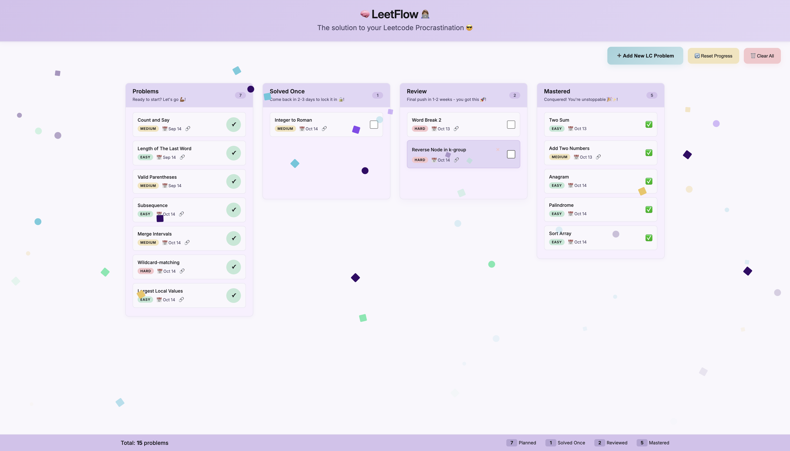

# 🧠 LeetFlow 👩🏽‍💻

> TL;DR: A simple Kanban-style tracker for your LeetCode practice, designed to turn scattered effort into visible progress.

## 🤔 Why I Built This

Like many aspiring software engineers, I knew LeetCode practice was essential for landing internships at top tech companies. But here's the thing – **I kept putting it off 😭**. Every time I sat down to practice, I'd think: _“I’d rather be building something I can actually use”_ So I'd skip leetcode and work on web projects instead.

But as I'm approaching the new grad world, I had to face reality: the interview process isn't changing anytime soon. If I want those opportunities, I need to stop avoiding LeetCode 👀.

So instead of grinding through random problems, I decided to solve my own problem first 😅.

LeetFlow is my answer to LeetCode procrastination. It's a simple Kanban board that turns scattered practice into visible progress. Because sometimes the best way to start coding is to build the tool that helps you code better.

## ✨ Features

- **📋 Kanban Board**: Visual progress tracking through 4 stages
  - Problems → Solved Once → Review → Mastered
- **🎯 Simple Problem Management**: Add problems with title, difficulty, and optional LeetCode URL
- **🎉 Celebration System**: Confetti animation when problems reach "Mastered" status
- **💾 Local Storage**: Your progress persists between sessions
- **📱 Responsive Design**: Works seamlessly on desktop and mobile
- **🔄 Bulk Actions**: Reset progress or clear all problems when needed
- **🎨 Clean UI**: Focus on functionality over flashy features

## 🚀 Philosophy: Simple but Useful

I wanted to keep LeetFlow **simple but extremely useful** for my specific needs:

- **No overcomplicated features** – just the essentials that actually matter
- **Visual progress tracking** – because seeing movement motivates action
- **Quick problem entry** – minimal friction to adding new problems
- **Persistent data** – Simple data storage that keeps your progress safe.
- **Celebration moments** – small wins deserve recognition

This isn't meant to replace LeetCode or other platforms. It's meant to make your existing practice more organized and motivating 🥳.

## 🛠️ Built With

- **React** - For the interactive UI
- **CSS Modules** - For clean, scoped styling
- **Local Storage** - For data persistence
- **Pure JavaScript** - No unnecessary dependencies

## 🎯 How It Works

1. **Add Problems**: Click "Add New LC Problem" and fill in the details
2. **Solve Initially**: Move to "Solved Once" after your initial successful attempt
3. **Review Strategically**: When you're ready, tackle the problem again to move it to "Review"
4. **Final Review**: Solve it one more time to reach Problems "Mastered"
5. **Track Your Journey**: See dates for when you added and completed each stage
6. **Celebrate Mastery**: Get confetti when problems reach "Mastered" status – you've earned it 🥳👏🏾!

## 🧠 The Science Behind the Flow

LeetFlow uses **spaced repetition**, a learning technique proven to improve long-term retention:

- **Problems**: Initial exposure - solve when ready 💪
- **Solved Once**: First review in 2-3 days to lock it in 🔒
- **Review**: Final review in 1-2 weeks for mastery 🚀
- **Mastered**: Pattern internalized! Interview ready! 🎉

Each column shows recommended timing, and dates help you track your spacing naturally.

## 🚀 Try It Live

**🔗 Use LeetFlow [Now](https://leetcode-kanban.vercel.app/)**

**Or run it locally:**

1. Clone this repository
2. Install dependencies
3. Start the development server
4. Open your localhost and start tracking your progress!

## 💭 Personal Reflection

This project perfectly embodies my learning philosophy: **build things you'll actually use**. Instead of just grinding LeetCode problems in isolation, I created this tool that makes the process more enjoyable for me.

The irony isn't lost on me 🤣....Yep, I kinda procrastinated on LeetCode by building a LeetCode tracker I know 😂. But that's exactly the point. Sometimes you have to embrace your nature instead of fighting it. I learn by building, so I built my way into better LeetCode habits 🌱.

Now when I practice DSA, I get the satisfaction of both solving problems AND using something I created myself. It's that intersection of practical utility and personal ownership that actually makes it more enjoyable 🫶🏾.

If you're struggling with consistency in your coding practice, maybe this simple tool can help you too. After all, the best project is the one you'll actually use and the best system is the one that works with your brain, not against it 😉.

## 🤝🏾 Contributing

If you have ideas for improvements that align with the **“simple but useful”** philosophy, I’d love to see them 😊.

Feel free to:

- 🛠 Suggest new features or improvements
- 🐛 Report bugs or issues
- 📦 Fork the repo and build your own version
- 📚 Share feedback to make LeetFlow better

> LeetFlow was built to make LeetCode practice more enjoyable - if it helps you on your journey too, that's a win 🎯.

---

_Happy leetcoding, and remember: the best project is the one you'll actually use 🚀_
